# 🔐 Vulnerability Analysis – Lab Week 7

## 📌 Course Information
- **Course:** IKB21403 – Vulnerability Analysis  
- **Programme:** Bachelor of IT (Hons) in Computer System Security  
- **Student Name:** Haziq Danial Bin Nor Azan  

---

## Project Overview
This lab focuses on analysing network traffic and identifying vulnerabilities using tools such as Wireshark, Nmap, and Nessus. The objective is to extract hidden information and understand security weaknesses in a system.

---

# Question 1: Analyse packet1.pcap and find the flag.

## Steps:
1. Open the .pcap file
   
- Launch Wireshark
- Open packet1.pcap
  
2. Look for suspicious traffic
   
- Most packets are ICMP (ping)
  
3. Follow the ICMP stream
   
- In Wireshark:
1. Click any ICMP packet
2. Right-click → Follow → ICMP Stream 

<p align="center">
  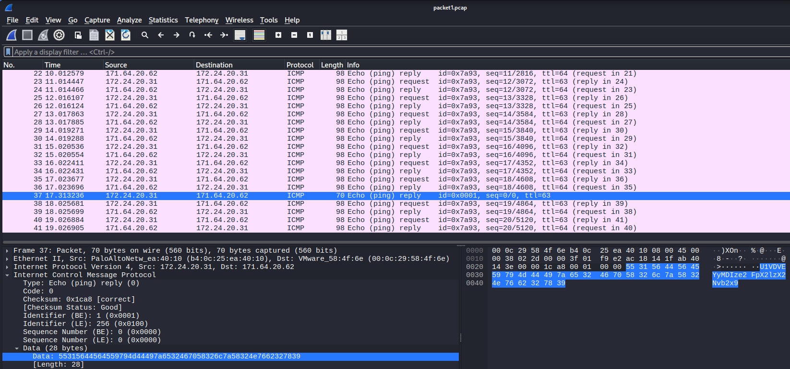
</p>

4. Check packet payload
- In the bottom pane:
- Look at Data / Payload section
- You’ll see something like:
  
```bash
U1VDVEYyMDIze2 FpX2lzX2 Nvb2x9
```

- This is Base64 encoded text

5. Go to website CyberChef and use FROM BASE64
- Paste the encoded text U1VDVEYyMDIze2 FpX2lzX2 Nvb2x9

<p align="center">
  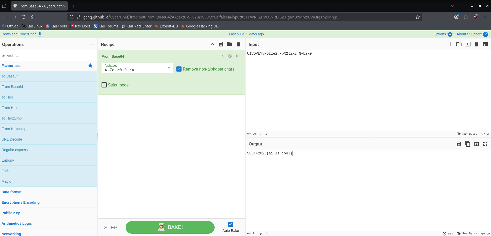
</p>

- We get the output is
  
```bash
SUCTF2023{ai_is_cool}
```
- Flag: SUCTF2023{ai_is_cool}
  
---

# Question 2: Analyse packet2.pcap and find the flag.

1. Identify the protocol
   
- You used Follow TCP Stream
- You see commands like:
   - USER
   - PASS
   - RETR global_thermonuclear_war.gamerules.txt
      
```bash
global_thermonuclear_war.gamerules.txt
```

2. Find transferred file
- Important line:
   - RETR global_thermonuclear_war.gamerules.txt
- A file was downloaded via FTP
- That file likely contains the flag
- Go to File - Export Object – Find FTP-DATA
- You can see global_thermonuclear_war.gamerules.txt and you save.

<p align="center">
  
</p>

4. Open the file
- You get:

```bash
https://tinyurl.com/yr5zprz4
```

<p align="center">
  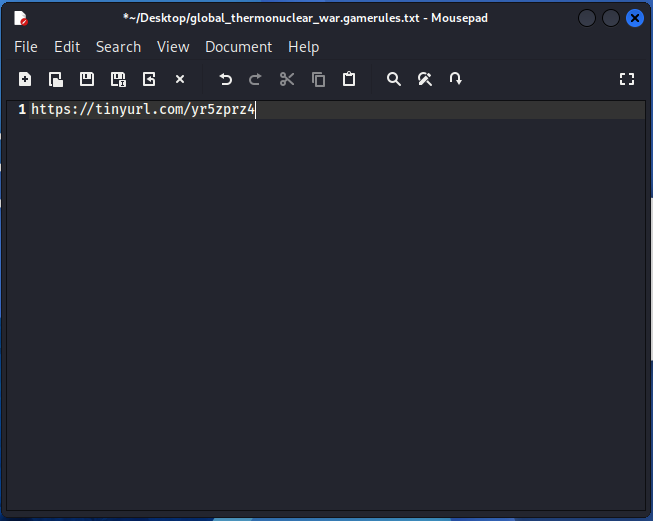
</p>

5. Open the TinyURL
- Open link URL
- You get some code or encoded text
- The code is Tic-Tac-Toe Cipher
  
<p align="center">
  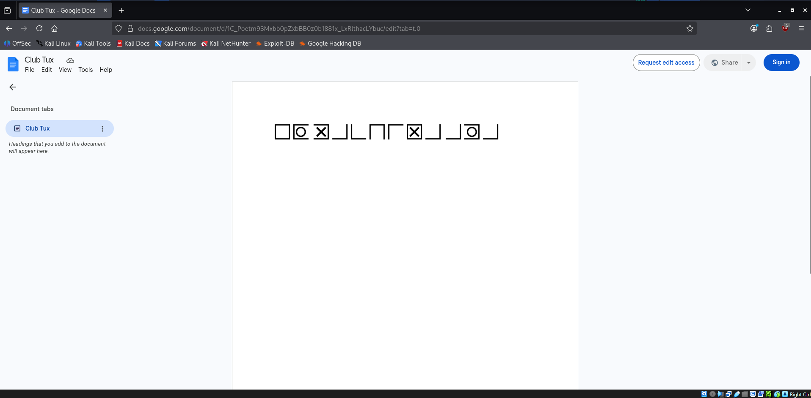
</p>

6. Identify encoding type
- Open you browser and search 
  
```bash
 https://www.dcode.fr/tic-tac-toe-cipher
```
- Tool used: dCode (Tic-Tac-Toe Chiper)
- You have to match the code and then you get the flag.
The result get
```bash
 EXMACHINAAVA
```

<p align="center">
  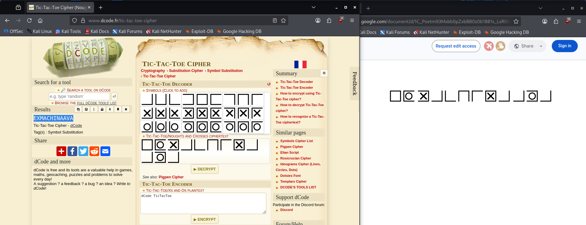
</p>

# Question 3: Interpret an Nmap Output
   - PORT STATE SERVICE VERSION
   - 21/tcp open ftp vsftpd 2.3.4
   - 22/tcp open ssh OpenSSH 5.3p1
   - 80/tcp open http Apache 2.2.8
   - 139/tcp open netbios-ssn
   - 445/tcp open microsoft-ds Windows 7 Professional 7601 Service Pack 1
- Questions:
1. What can an attacker do with each port?
  
- Port 21 (FTP – vsftpd 2.3.4)
   - Upload and download files
   - Abuse anonymous login
   - Gain backdoor access (this version allows it)
  
- Port 22 (SSH – OpenSSH 5.3p1)
   - Crack password hashes via brute force
   - Execute commands remotely once access is gained
     
- Port 80 (HTTP – Apache 2.2.8)
   - Launch web-based attacks such as SQL injection, XSS, and directory traversal
   - Take control of the website
     
- Port 139 (NetBIOS)
   - View available shares and users
   - Gather information

- Port 445 (SMB – Windows 7 SP1)
   - Exploit SMB protocol flaws
   - Execute remote code injections (like EternalBlue)
2. What vulnerabilities are likely present based on the version?

   - vsftpd 2.3.4 → Backdoor vulnerability
   - OpenSSH 5.3p1 → Weak encryption / brute-force risk
   - Apache 2.2.8 → Outdated, many known exploits
   - SMB (Windows 7 SP1) → EternalBlue (MS17-010)
     
3. Which one is the highest risk and why?
   
- Port 445 (SMB)
   - Allows remote code execution without authentication
   - Widely exploited (e.g. WannaCry ransomware)
   - Critical impact → full system takeover
     
4. What attack path can be built from this?

   - Scan target → identify open ports
   - Exploit SMB (445) → gain system access
   - Use NetBIOS (139) → gather more info
   - Use FTP (21) → upload malicious files
   - Use SSH (22) → maintain persistent access
   - Attack web server (80) → expand control

5. What should be the remediation?

   - Update all outdated services
   - Disable unused ports
   - Patch SMB vulnerabilities (MS17-010)
   - Use strong passwords & SSH key authentication
   - Firewall restrictions
   - Network segmentation

# Question 4: Identify the OS (OS Fingerprinting) – TTL

- Image 1
<p align="center">
  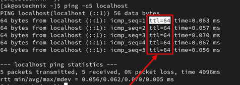
</p> 

- Answer :
```bash
OS Linux / Unix
```

- Image 2
<p align="center">
  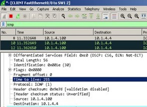
</p> 

- Answer : 
```bash
Network device (Router / Cisco)
```

- Image 3
<p align="center">
  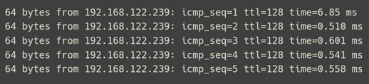
</p>

- Answer :
```bash
OS Windows
```

# Question 5: Analyse the Nessus file
- Upload to your nessus (Network_Scan.nessus) and analyse the files. Focus on critical or high findings that was identifies in analysis named “Ghostcat”.

- Fist you must set up you Nessus in kali
- After set up you must start or open your command in terminal
```bash
 Sudo systemctl start nessusd
```
<p align="center">
  
</p>

- Open your browser and type this command to open Nessud
```bash
https://kali:8834 / https://localhost:8834
```
- Enter your name and password
<p align="center">
  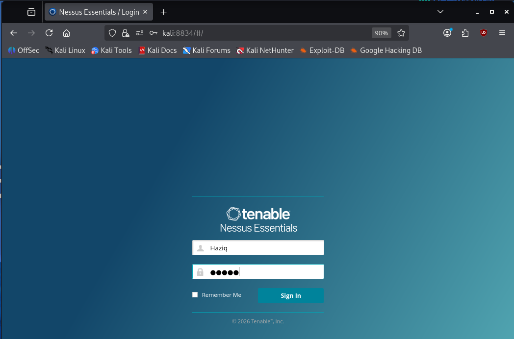
</p>

- This is a page for Nessus
<p align="center">
  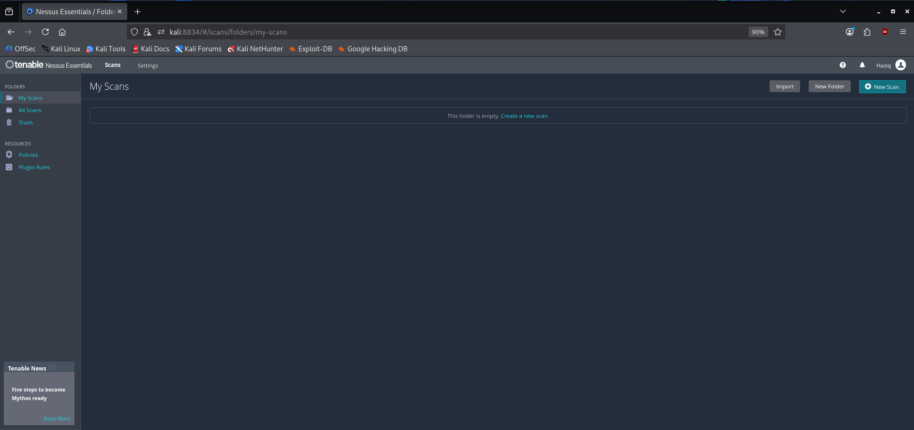
</p>

- First import file from Week 7
- Choose file Network_Scan.nessus
-  And click Open
<p align="center">
  
</p>

- This is your Scan
<p align="center">
  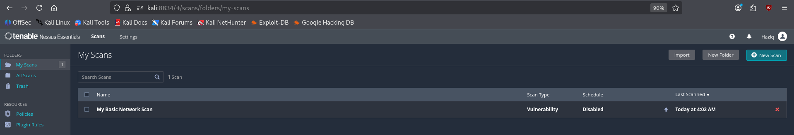
</p>

- After that you click on My Basic Network Scan
- Click on Vulnerabilities
- Search name Tomcat
- Click on folder Apache Tomcat
<p align="center">
  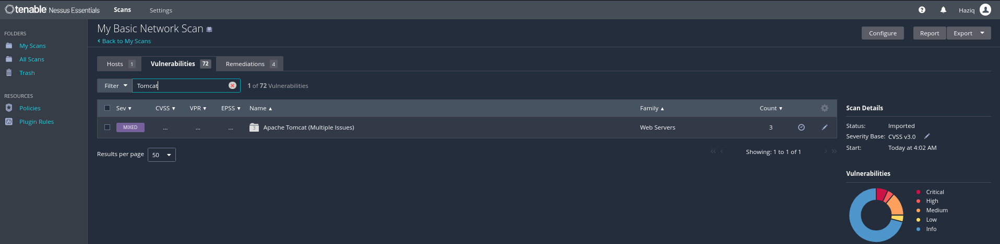
</p>

- You can see get 3 Vulnerabilities
   - CRITICAL
   - MEDIUM
   - INFO
<p align="center">
  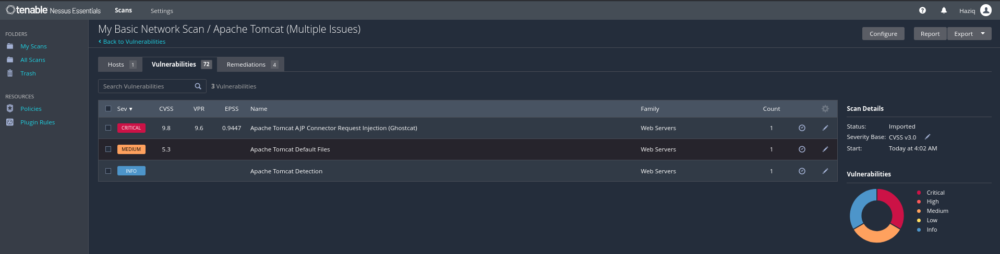
</p>

- Click on CRITICAL Vulnerabilities
- Get name (Ghostcat)
- CVSS v3.0 Base Score 9.8
- Port 8009 / tcp /ajp12
- Hosts 192.168.232.139
- CVE : CVE-2020-1938, CVE-2020-1745
<p align="center">
  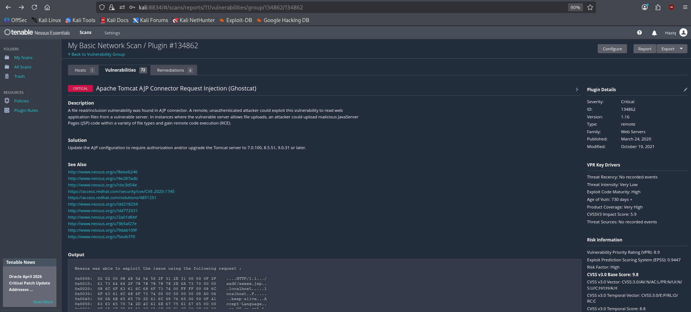
</p>

<p align="center">
  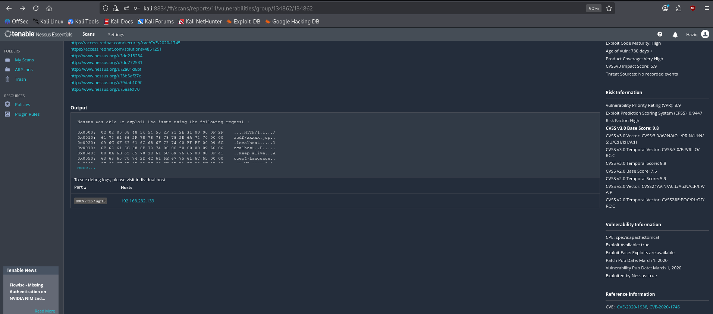
</p>

1. What is the affected Port number
   - 8009
     
2. What is the Affected protocol
   - AJP (Apache JServ Protocol)
     
3. What is the CVSS Score of vulnerability found
   - 9.8 Critical
     
4. Can you find any exploit related to this vulnerability?
   - File inclusion / file disclosure
   - /WEB-INF/web.xml
     
5. Find CVE for this vulnerability.
   - CVE-2020-1938
   - CVE-2020-1745


